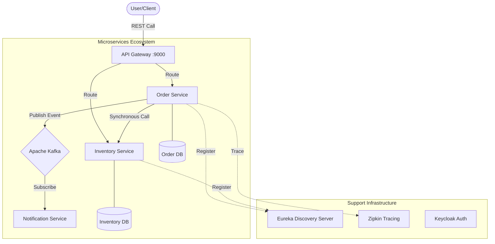
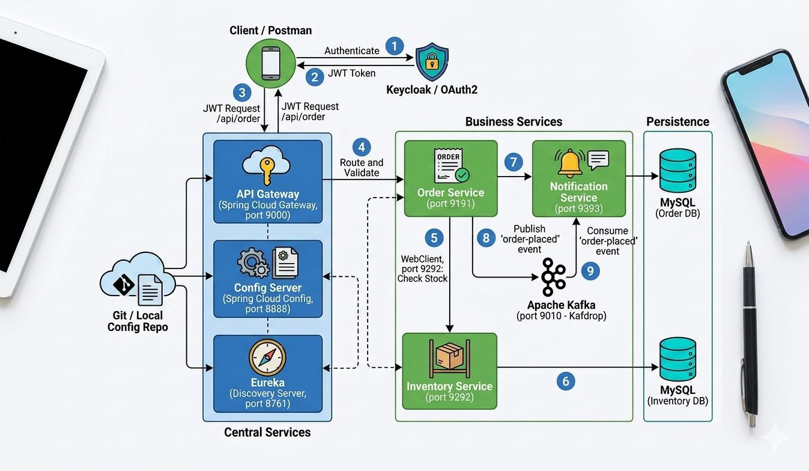
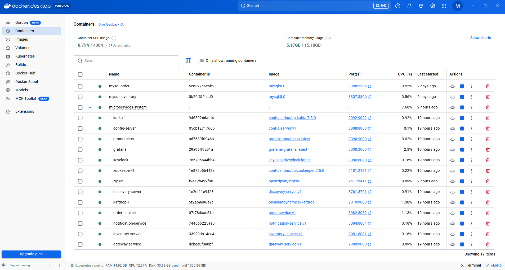
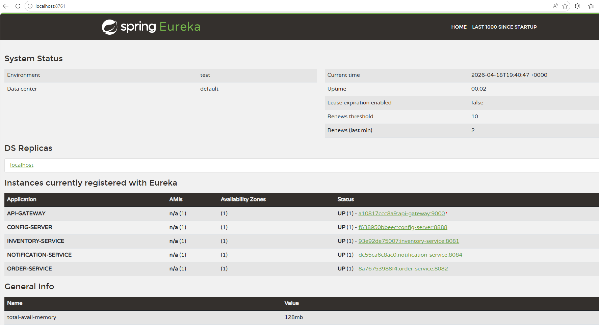
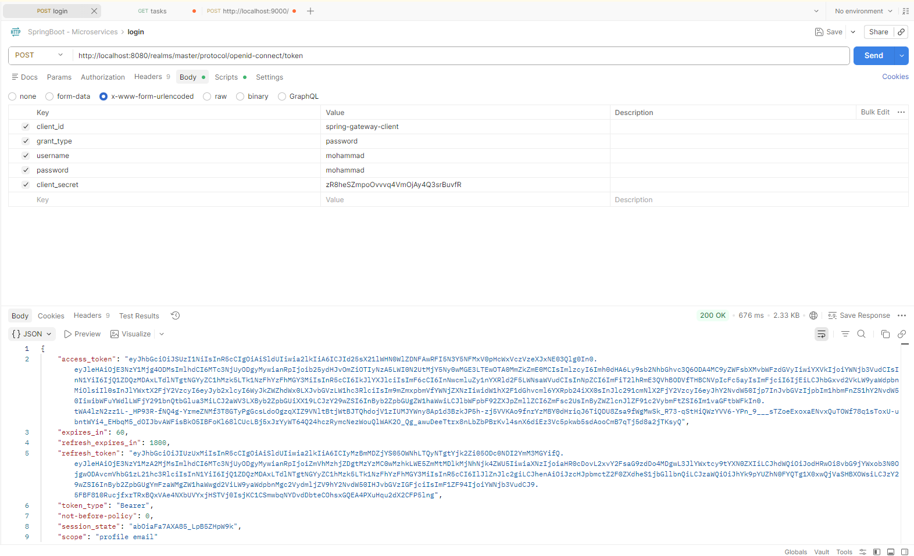
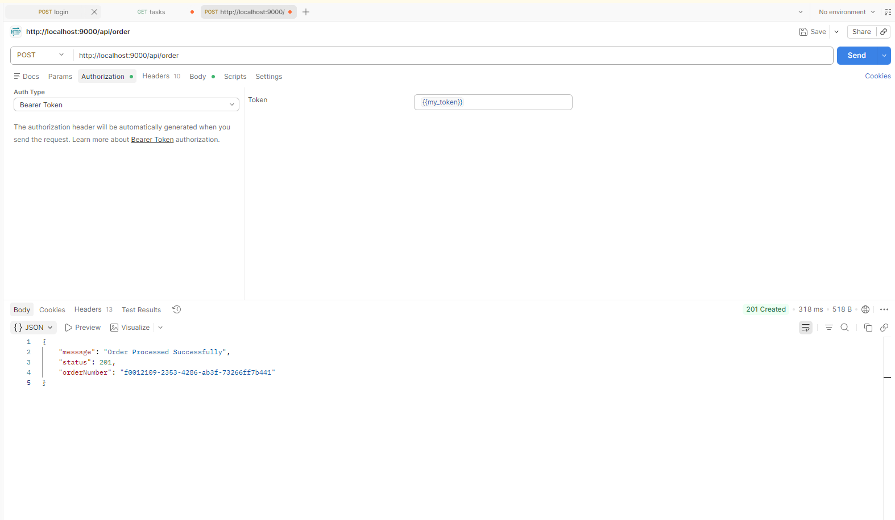

---

# Microservices Order Management System

Welcome to the **Microservices Order Management System**, a production-ready, distributed system built with **Spring
Boot 3**, **Spring Cloud**, **Docker**, and **Kubernetes**. It demonstrates a full-scale architecture for handling
orders, inventory, and notifications in a real-world scenario.

---

## Tech Stack & Architecture

This project is a showcase of modern software engineering principles:

* **Microservices Framework:** Spring Boot 3.2.x
* **Build Tool:** Gradle (Groovy DSL)
* **Persistence:** Spring Data JPA
* **Service Discovery:** Spring Cloud Netflix Eureka
* **API Gateway:** Spring Cloud Gateway (Centralized Entry Point)
* **Config Management:** Spring Cloud Config Server (Centralized Configuration)
* **Database:** MySQL (Separate DB per service for Loose Coupling)
* **Communication:**
    * **Synchronous:** WebClient (Inter-service REST calls)
    * **Asynchronous:** Apache Kafka (Event-driven architecture)
* **Security:** Keycloak (OAuth2 & OpenID Connect)
* **Observability & Monitoring:**
    * **Tracing:** Distributed Tracing with Zipkin & Micrometer
    * **Metrics:** Prometheus & Grafana for real-time monitoring
* **Testing:** Unit Testing (Mockito), Integration Testing (Testcontainers, MockWebServer)
* **Containerization:** Docker, Docker Compose
* **Orchestration:** Kubernetes (K8s)

---

## System Components

1. **Discovery Server (Eureka):** The service registry for all microservices.
2. **Config Server:** Centralized management of application properties for all environments.
3. **API Gateway:** Single entry point, handling routing and security filters.
4. **Order Service:** Manages customer orders and publishes events to Kafka topics.
5. **Inventory Service:** Handles real-time stock verification.
6. **Notification Service:** An event-driven listener that processes Kafka messages and sends alerts.

---

## Key Features

### Advanced Integration Testing (Testcontainers)

We use **Testcontainers** to ensure high reliability.
> *Why this matters?* Our test suite spins up **actual Docker containers** for MySQL and Kafka during the build process.
> This guarantees that the system works in a production-like environment before deployment.

### Enterprise-Grade Security

Integrated with **Keycloak** as a centralized Identity Provider. All microservices are secured, requiring valid JWT
tokens issued via OAuth2 flows.

### Event-Driven Scalability

By using **Apache Kafka**, we decouple the Order and Notification services. This asynchronous communication ensures that
the system remains responsive even under heavy loads.

### Database per Service Design

Each microservice maintains its own MySQL database, promoting loose coupling, independent deployments, and scalability.

### Event-Driven Architecture

Asynchronous communication via Apache Kafka enables decoupling of services, improving fault tolerance and system
resilience.

### Architecture Diagram





## Project Screenshots

### Docker Containers Status



### Eureka Dashboard



### Postman Auth Request



### Postman Place Order API



Note: All screenshots represent the system running in a live Kubernetes environment, showcasing service health and
inter-service communication.

---

## How to Run

### Prerequisites

* Java 17+
* Docker Desktop
* Kubernetes (Optional/Minikube)

### Steps

1. **Clone the repository:**
   ```bash
   git clone https://github.com/mohammad-ali-abudalou/microservices-system.git
   cd microservices-system
   ```

2. **Build the Project (Gradle):**
   ```bash
   ./gradlew clean build -x test
   ```

3. **Spin up the Infrastructure (Docker Compose):**
   ```bash
   docker-compose up -d
   ```

4. **Access the Dashboards:**
    * **Eureka Dashboard:** `http://localhost:8761`
    * **Keycloak Admin:** `http://localhost:8080`
    * **Zipkin Traces:** `http://localhost:9411`
    * **Kafdrop (Kafka UI):** `http://localhost:9010`
    * **Grafana Metrics:** `http://localhost:3000`

---

## API Endpoints

All requests are routed through the **API Gateway** on port `9000` (or your configured gateway port). Authentication is
handled via **Keycloak** using Bearer Tokens.

### Order Service

| Method   | Endpoint     | Description                                    | Access        |
|----------|--------------|------------------------------------------------|---------------|
| **POST** | `/api/order` | Place a new order & trigger Kafka notification | Authenticated |
| **GET**  | `/api/order` | Retrieve order history for the user            | Authenticated |

### Inventory Service

| Method   | Endpoint         | Description                                       | Access           |
|----------|------------------|---------------------------------------------------|------------------|
| **GET**  | `/api/inventory` | Check stock availability (Query param: `skuCode`) | Internal / Admin |
| **POST** | `/api/inventory` | Update or add new stock items                     | Admin Only       |

### Identity Provider (Keycloak)

| Method   | Endpoint                                        | Description                               | Access     |
|----------|-------------------------------------------------|-------------------------------------------|------------|
| **POST** | `/realms/{realm}/protocol/openid-connect/token` | Exchange credentials for JWT Access Token | Public     |
| **POST** | `/admin/realms/{realm}/users`                   | User registration and management          | Admin Only |

---

## How to Test the Flow

1. **Login:** Obtain a JWT token from Keycloak using the user credentials.
2. **Place Order:** Send a `POST` request to `/api/order` with the `Bearer <Token>` in the header.
3. **Verify Notification:** Check the **Notification Service** logs or **Kafdrop** at `http://localhost:9010` to see the
   event being processed.
4. **Monitor:** Visit **Grafana** or **Zipkin** to trace the request from the Gateway to the Inventory check.

---

## CI/CD & DevOps

This project features a fully automated CI/CD pipeline using GitHub Actions:

* **Continuous Integration:** Every push triggers a build and executes unit tests (Mockito) and integration tests (
  Testcontainers with MySQL and Kafka) in a clean environment.
* **Continuous Deployment:** On successful tests, Docker images are automatically built and pushed to **Docker Hub**,
  ensuring the latest version is always ready for deployment.
* **Infrastructure as Code:** Kubernetes manifests are provided for production deployment.
* **Observability Integration:** Metrics and traces are collected for monitoring with Prometheus and Zipkin.

---

## SOLID & Clean Code

This project strictly follows:

* **S.O.L.I.D Principles:** Ensuring maintainability and scalability.
* **DTO Pattern:** Decoupling internal data models from public APIs.
* **Global Exception Handling:** Providing a unified and professional error response structure.
* **Lombok:** Minimizing boilerplate code for better readability.

---

## Methodology

* **Agile/Scrum:** Developed using an Agile mindset. Tasks, features, and bugs were managed through **GitHub Projects**
  using a Kanban-style board to track progress and sprints.

---

## Contact & Support

Developed by **Mohammad Ali Abu-Dalou**.

* **Mobile:** +962790132315
* **Email:** abudalou.mohammad@gmail.com
* **GitHub:** https://github.com/mohammad-ali-abudalou/
* **LinkedIn:** https://www.linkedin.com/in/mohammad-ali-abudalou/

Feel free to reach out for collaborations or questions!

---
