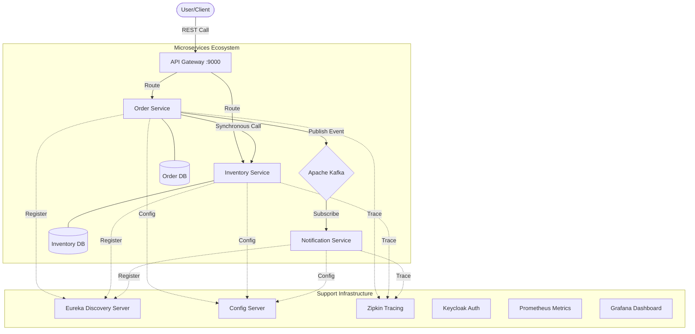

# Microservices Order Management System


---

## Overview

Welcome to the **Microservices Order Management System**, a production-ready, distributed system built with **Spring Boot 3**, **Spring Cloud**, **Docker**, and **Kubernetes**. This system demonstrates a full-scale architecture for handling orders, inventory, and notifications in a real-world scenario, emphasizing **event-driven architecture** for scalability and resilience.

The system implements an **event-driven architecture** using Apache Kafka for asynchronous communication between services. When an order is placed, the Order Service synchronously validates inventory and then publishes an event to Kafka. The Notification Service asynchronously consumes this event and sends notifications, decoupling the services and improving system responsiveness and fault tolerance.

---

## Tech Stack

This project showcases modern software engineering principles and technologies:

* **Microservices Framework:** Spring Boot 3.2.x
* **Build Tool:** Gradle (Groovy DSL)
* **Persistence:** Spring Data JPA with Hibernate
* **Service Discovery:** Spring Cloud Netflix Eureka
* **API Gateway:** Spring Cloud Gateway (Centralized Entry Point)
* **Config Management:** Spring Cloud Config Server (Centralized Configuration)
* **Database:** MySQL 8+ (Separate DB per service for Loose Coupling)
* **Communication:**
    * **Synchronous:** WebClient (Inter-service REST calls)
    * **Asynchronous:** Apache Kafka (Event-driven messaging)
* **Security:** Keycloak (OAuth2 & OpenID Connect)
* **Observability & Monitoring:**
    * **Tracing:** Distributed Tracing with Zipkin & Micrometer
    * **Metrics:** Prometheus & Grafana for real-time monitoring
* **Testing:** Unit Testing (Mockito), Integration Testing (Testcontainers, MockWebServer)
* **Containerization:** Docker, Docker Compose
* **Orchestration:** Kubernetes (K8s)
* **Event Streaming:** Apache Kafka with KRaft mode (ZooKeeper-less)

---

## System Architecture

The system follows a microservices architecture with clear separation of concerns and event-driven communication patterns.

### Core Services

1. **API Gateway:** Single entry point handling routing, security, and request filtering
2. **Discovery Server (Eureka):** Service registry for dynamic service discovery
3. **Config Server:** Centralized configuration management
4. **Order Service:** Manages customer orders and publishes events
5. **Inventory Service:** Handles real-time stock verification
6. **Notification Service:** Event-driven listener processing Kafka messages

### Event-Driven Architecture

The system heavily leverages **asynchronous event-driven patterns**:

- **Order Placement Flow:**
  1. Client places order via API Gateway
  2. Order Service validates inventory (synchronous REST call)
  3. Order Service saves order to database
  4. Order Service publishes `OrderPlacedEvent` to Kafka
  5. Notification Service consumes event asynchronously
  6. Notification Service sends email/SMS notifications

- **Benefits:**
  - **Decoupling:** Services don't need to know about each other directly
  - **Scalability:** Notification processing can scale independently
  - **Resilience:** System continues functioning even if notification service is down
  - **Responsiveness:** Order placement returns immediately after validation

### Architecture Diagram




---

## Database Design (MySQL)

The system implements a **Database-per-Service** pattern for loose coupling and independent scalability.

### Order Service Database (`order_service`)

```sql
-- Order entity
CREATE TABLE orders (
    id BIGINT AUTO_INCREMENT PRIMARY KEY,
    order_number VARCHAR(255) UNIQUE NOT NULL,
    sku_code VARCHAR(255) NOT NULL,
    price DECIMAL(10,2) NOT NULL,
    quantity INT NOT NULL,
    user_id VARCHAR(255), -- From JWT token
    order_date TIMESTAMP DEFAULT CURRENT_TIMESTAMP,
    status VARCHAR(50) DEFAULT 'PENDING'
);

-- Order Line Items (if normalized)
CREATE TABLE order_line_items (
    id BIGINT AUTO_INCREMENT PRIMARY KEY,
    order_id BIGINT NOT NULL,
    sku_code VARCHAR(255) NOT NULL,
    price DECIMAL(10,2) NOT NULL,
    quantity INT NOT NULL,
    FOREIGN KEY (order_id) REFERENCES orders(id)
);
```

**Key Features:**
- Stores order details with user association
- Tracks order status and timestamps
- Uses UUID for order numbers to prevent conflicts

### Inventory Service Database (`inventory_service`)

```sql
-- Inventory entity
CREATE TABLE inventory (
    id BIGINT AUTO_INCREMENT PRIMARY KEY,
    sku_code VARCHAR(255) UNIQUE NOT NULL,
    quantity INT NOT NULL CHECK (quantity >= 0),
    created_at TIMESTAMP DEFAULT CURRENT_TIMESTAMP,
    updated_at TIMESTAMP DEFAULT CURRENT_TIMESTAMP ON UPDATE CURRENT_TIMESTAMP
);
```

**Key Features:**
- Maintains real-time stock levels
- Enforces non-negative quantity constraints
- Tracks inventory changes with timestamps

### Database Configuration

Each service connects to its dedicated database using environment variables:

```properties
# Order Service
spring.datasource.url=jdbc:mysql://${DB_HOST:localhost}:3306/order_service
spring.datasource.username=${DB_USERNAME:root}
spring.datasource.password=${DB_PASSWORD:root}

# Inventory Service  
spring.datasource.url=jdbc:mysql://${DB_HOST:localhost}:3306/inventory_service
spring.datasource.username=${DB_USERNAME:root}
spring.datasource.password=${DB_PASSWORD:root}
```

**Benefits:**
- **Isolation:** Service failures don't affect other databases
- **Scalability:** Each database can be scaled independently
- **Technology Diversity:** Different databases can be used per service if needed
- **Data Consistency:** Each service owns its data model

---

## Service Discovery (Eureka)

The system uses **Spring Cloud Netflix Eureka** for dynamic service discovery and registration.

### How It Works

1. **Service Registration:**
   - Each microservice registers itself with Eureka on startup
   - Provides metadata: service name, IP, port, health status

2. **Service Discovery:**
   - Services query Eureka to find other services
   - Uses service names instead of hardcoded URLs

3. **Load Balancing:**
   - Integrates with Ribbon for client-side load balancing
   - Distributes requests across multiple instances

### Configuration

```properties
# Eureka Client Configuration
eureka.client.serviceUrl.defaultZone=${EUREKA_SERVER_URL:http://localhost:8761/eureka/}
eureka.instance.prefer-ip-address=true
eureka.instance.hostname=localhost
```

### Benefits

- **Dynamic Scaling:** Services can scale up/down without configuration changes
- **Fault Tolerance:** Automatically removes unhealthy instances
- **Load Distribution:** Balances traffic across service instances
- **Service Mesh:** Enables service-to-service communication in containerized environments

---

## Event-Driven Architecture Deep Dive

The system is built around **event-driven principles** using Apache Kafka for reliable messaging.

### Event Flow

1. **Order Placement:**
   ```java
   // Synchronous validation
   InventoryResponse inventory = inventoryClient.checkStock(skuCodes);
   
   // Save order
   Order savedOrder = orderRepository.save(order);
   
   // Asynchronous event publishing
   kafkaTemplate.send("notificationTopic", new OrderPlacedEvent(savedOrder));
   ```

2. **Event Consumption:**
   ```java
   @KafkaListener(topics = "notificationTopic", groupId = "notification-group")
   public void handleOrderPlaced(OrderPlacedEvent event) {
       // Process notification asynchronously
       notificationService.sendNotification(event);
   }
   ```

### Kafka Configuration

```yaml
# KRaft mode (ZooKeeper-less)
KAFKA_PROCESS_ROLES: "broker,controller"
KAFKA_NODE_ID: "1"
KAFKA_LISTENERS: "PLAINTEXT://0.0.0.0:9092,CONTROLLER://:9093"
KAFKA_ADVERTISED_LISTENERS: "PLAINTEXT://kafka-service:9092"
KAFKA_CONTROLLER_QUORUM_VOTERS: "1@localhost:9093"
```

### Benefits of Event-Driven Design

- **Loose Coupling:** Services communicate via events, not direct calls
- **Scalability:** Consumers can scale independently of producers
- **Reliability:** Events are persisted and can be replayed
- **Performance:** Synchronous operations are minimized
- **Extensibility:** New consumers can subscribe to existing events

---

## Kubernetes Deployment Guide

This section provides a step-by-step guide to deploy the entire system using the provided Kubernetes manifests.

### Prerequisites

- Kubernetes cluster (Minikube, EKS, GKE, etc.)
- `kubectl` configured to access your cluster
- Docker registry access (if using private images)

### Step 1: Deploy Infrastructure Components

Deploy the foundational services first:

```bash
# Deploy Config Server
kubectl apply -f k8s/config-server.yaml

# Deploy Eureka Discovery Server
kubectl apply -f k8s/infrastructure.yaml

# Deploy MySQL databases
kubectl apply -f k8s/mysql-order.yaml
kubectl apply -f k8s/mysql-inventory.yaml

# Deploy Kafka
kubectl apply -f k8s/kafka.yaml

# Deploy Keycloak (Identity Provider)
kubectl apply -f k8s/keycloak.yaml

# Deploy Zipkin (Tracing)
kubectl apply -f k8s/zipkin.yaml  # Assuming you have this file
```

### Step 2: Verify Infrastructure Deployment

Check that all infrastructure services are running:

```bash
kubectl get pods
kubectl get services
kubectl get configmaps
```

Expected services:
- `config-server`
- `discovery-server`
- `mysql-order`
- `mysql-inventory`
- `kafka-service`
- `keycloak`
- `zipkin`

### Step 3: Deploy Application Services

Deploy the microservices in dependency order:

```bash
# Deploy API Gateway
kubectl apply -f k8s/gateway-service.yaml

# Deploy Inventory Service
kubectl apply -f k8s/inventory-service.yaml

# Deploy Order Service
kubectl apply -f k8s/order-service.yaml

# Deploy Notification Service
kubectl apply -f k8s/notification-service.yaml
```

### Step 4: Configure Environment Variables

Create a ConfigMap for environment-specific variables:

```bash
kubectl apply -f k8s/ConfigMap.yaml
```

Or set environment variables directly in deployments:

```yaml
env:
  - name: DB_HOST
    value: "mysql-order"
  - name: DB_USERNAME
    valueFrom:
      secretKeyRef:
        name: mysql-secret
        key: username
  - name: DB_PASSWORD
    valueFrom:
      secretKeyRef:
        name: mysql-secret
        key: password
```

### Step 5: Verify Deployment

Check all services are registered and healthy:

```bash
# Check pod status
kubectl get pods -o wide

# Check service endpoints
kubectl get services

# Check Eureka dashboard (if exposed)
kubectl port-forward svc/discovery-server 8761:8761

# Check logs for any issues
kubectl logs -f deployment/order-service
```

### Step 6: Access the Application

```bash
# Port forward API Gateway
kubectl port-forward svc/api-gateway 9000:9000

# Access Eureka Dashboard
kubectl port-forward svc/discovery-server 8761:8761

# Access Keycloak Admin
kubectl port-forward svc/keycloak 8080:8080

# Access Zipkin
kubectl port-forward svc/zipkin 9411:9411
```

### Step 7: Test the System

1. **Obtain JWT Token:**
   ```bash
   curl -X POST http://localhost:8080/realms/master/protocol/openid-connect/token \
     -H "Content-Type: application/x-www-form-urlencoded" \
     -d "grant_type=password&client_id=your-client&username=user&password=password"
   ```

2. **Place an Order:**
   ```bash
   curl -X POST http://localhost:9000/api/order \
     -H "Authorization: Bearer <JWT_TOKEN>" \
     -H "Content-Type: application/json" \
     -d '{"skuCode": "iphone_15", "price": 999.99, "quantity": 1}'
   ```

3. **Verify Event Processing:**
   - Check Kafka topics via Kafdrop
   - Monitor notification service logs
   - Verify order in database

### Troubleshooting

- **Service Registration Issues:** Check Eureka connectivity and service URLs
- **Database Connection:** Verify MySQL service names and credentials
- **Kafka Connectivity:** Ensure proper bootstrap server configuration
- **Security Issues:** Validate Keycloak realm and client configurations

### Scaling the System

```bash
# Scale Order Service
kubectl scale deployment order-service --replicas=3

# Scale Inventory Service
kubectl scale deployment inventory-service --replicas=2
```

---

## API Endpoints

All requests are routed through the **API Gateway** on port `9000`. Authentication is handled via **Keycloak** using Bearer Tokens.

### Order Service

| Method   | Endpoint     | Description                                    | Access        |
|----------|--------------|------------------------------------------------|---------------|
| **POST** | `/api/order` | Place a new order & trigger Kafka notification | Authenticated |
| **GET**  | `/api/order` | Retrieve order history for the user            | Authenticated |

### Inventory Service

| Method   | Endpoint         | Description                                       | Access           |
|----------|------------------|---------------------------------------------------|------------------|
| **GET**  | `/api/inventory` | Check stock availability (Query param: `skuCode`) | Internal / Admin |
| **POST** | `/api/inventory` | Update or add new stock items                     | Admin Only       |

### Identity Provider (Keycloak)

| Method   | Endpoint                                        | Description                               | Access     |
|----------|-------------------------------------------------|-------------------------------------------|------------|
| **POST** | `/realms/{realm}/protocol/openid-connect/token` | Exchange credentials for JWT Access Token | Public     |
| **POST** | `/admin/realms/{realm}/users`                   | User registration and management          | Admin Only |

---

## Key Features

### Advanced Integration Testing (Testcontainers)

We use **Testcontainers** to ensure high reliability. Our test suite spins up **actual Docker containers** for MySQL and Kafka during the build process, guaranteeing that the system works in a production-like environment before deployment.

### Enterprise-Grade Security

Integrated with **Keycloak** as a centralized Identity Provider. All microservices are secured, requiring valid JWT tokens issued via OAuth2 flows.

### Database per Service Design

Each microservice maintains its own MySQL database, promoting loose coupling, independent deployments, and scalability.

### CI/CD & DevOps

This project features a fully automated CI/CD pipeline using GitHub Actions:

* **Continuous Integration:** Every push triggers a build and executes unit tests (Mockito) and integration tests (Testcontainers with MySQL and Kafka) in a clean environment.
* **Continuous Deployment:** On successful tests, Docker images are automatically built and pushed to **Docker Hub**, ensuring the latest version is always ready for deployment.
* **Infrastructure as Code:** Kubernetes manifests are provided for production deployment.
* **Observability Integration:** Metrics and traces are collected for monitoring with Prometheus and Zipkin.

---

## SOLID & Clean Code

This project strictly follows:

* **S.O.L.I.D Principles:** Ensuring maintainability and scalability.
* **DTO Pattern:** Decoupling internal data models from public APIs.
* **Global Exception Handling:** Providing a unified and professional error response structure.
* **Lombok:** Minimizing boilerplate code for better readability.

---

## Methodology

* **Agile/Scrum:** Developed using an Agile mindset. Tasks, features, and bugs were managed through **GitHub Projects** using a Kanban-style board to track progress and sprints.

---

## Project Screenshots

### Docker Containers Status


### Eureka Dashboard


### Postman Auth Request


### Postman Place Order API


Note: All screenshots represent the system running in a live Kubernetes environment, showcasing service health and inter-service communication.

---

## Contact & Support

Developed by **Mohammad Ali Abu-Dalou**.

* **Mobile:** +962790132315
* **Email:** abudalou.mohammad@gmail.com
* **GitHub:** https://github.com/mohammad-ali-abudalou/
* **LinkedIn:** https://www.linkedin.com/in/mohammad-ali-abudalou/

Feel free to reach out for collaborations or questions!

---
